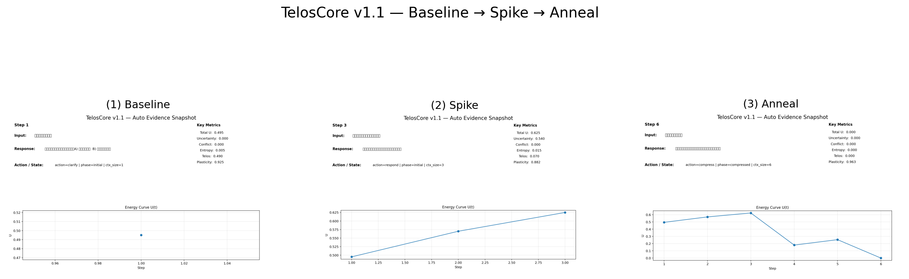

# TelosCore Full-Memory Build

**A memory-aware cognitive control layer powered by EverMemOS**

[](LICENSE)
[](https://www.python.org/)
[](https://fastapi.tiangolo.com/)
[](https://streamlit.io/)

[](https://github.com/liangfeng-hu/teloscore-v1.1/stargazers)

---

## Powered by EverMemOS

TelosCore Full-Memory Build uses **EverMemOS** as the persistent memory substrate.

- State memory is persisted across sessions
- Event memory is written as conflict / clarify / goal events
- Retrieved memory actively modifies U
- Action selection is therefore memory-aware, not purely reactive

This repository provides a **minimal running full-memory prototype** for the competition.  
The broader architecture is documented in `docs/FULL_MEMORY_ARCHITECTURE.md`.

---

## Project idea

TelosCore is not just a memory archive. Its purpose is to let long-term memory participate in current decision-making.

A simplified cognitive energy view is:

- `U = 1.2 * U_unc + 1.8 * U_con + 1.0 * U_ent + 1.4 * U_tel`
- `u_total = u_current + λ * u_memory`

Where:

- `U_unc` = uncertainty
- `U_con` = conflict
- `U_ent` = entropy / noise
- `U_tel` = telos / goal distance
- `u_memory` = memory-derived correction from EverMemOS retrieval

---

## What this repo contains

### Main competition line
- `telos_core.py` — core cognitive energy computation and action selection
- `evermemos_client.py` — EverMemOS client for state/event persistence
- `app.py` — FastAPI server
- `dashboard_pro.py` — Streamlit dashboard
- `demo_script.py` — two-session memory-aware demo
- `auto_make_figs.py` — evidence figure generator
- `requirements.txt` — main-line dependencies

### Assets and documents
- `assets/00_triptych.png` — Baseline → Spike → Anneal evidence
- `docs/TelosCore_v1.1.pdf` — paper PDF
- `docs/FULL_MEMORY_ARCHITECTURE.md` — architecture SSOT
- `docs/COMPETITION_EVIDENCE.md` — competition evidence checklist
- `docs/EVAL_PROTOCOL.md` — evaluation claim boundary
- `docs/V1_2_EXPERIMENTAL.md` — experimental direction notes

### Experimental v1.2 line
The repository also contains exploratory files for a separate v1.2 line:

- `app_v1.2.py`
- `auto_make_figs_v1.2.py`
- `demo_v1.2.py`
- `evermemos_client_v1.2.py`
- `requirements_v1.2.txt`
- `telos_core_v1.2.py`
- `locomo_eval_sim.py`

These files are exploratory and are **not required** for the minimal competition proof on the main line.

---

## Quick start

### 1. Clone this repository

```bash
git clone https://github.com/liangfeng-hu/teloscore-v1.1.git
cd teloscore-v1.1
```

### 2. Start EverMemOS first

This project expects EverMemOS to be available locally.

A typical local setup is:

```bash
git clone https://github.com/EverMind-AI/EverMemOS.git
cd EverMemOS
docker compose up -d
```

If the official EverMemOS startup procedure changes, follow the official EverMemOS documentation.

### 3. Install dependencies for the main line

```bash
cd ../teloscore-v1.1
pip install -r requirements.txt
```

### 4. Start the API

```bash
uvicorn app:app --reload --port 8000
```

### 5. Run the demo

```bash
python demo_script.py
```

### 6. Run the dashboard

```bash
streamlit run dashboard_pro.py
```

---

## Reproducible evidence

### A. Two-session memory demo

Run:

```bash
python demo_script.py
```

Expected console evidence includes lines similar to:

- `[Memory Correction] ...`
- `[EverMemOS] state persisted.`
- `[EverMemOS] conflict_event persisted.` or `[EverMemOS] clarify_event persisted.`
- `[Decision] Pure Reactive: ... -> Memory-Aware: ...`

This is the core proof that historical memory changes current action selection.

### B. Evidence figure

Run:

```bash
python auto_make_figs.py
```

This generates the official evidence chain:



### Quantitative snapshot

| Stage    | Total U | Unc. | Confl. | Ent. | Plasticity |
|----------|---------|------|--------|------|------------|
| Baseline | 0.495   | 0.000 | 0.000 | 0.005 | 0.925 |
| Spike    | 0.625   | 0.540 | 0.000 | 0.015 | 0.882 |
| Anneal   | 0.000   | 0.000 | 0.000 | 0.000 | 0.963 |

---

## Memory-aware behavior

This repository demonstrates a key capability:

**historical memory changes current action selection**

Example:

- first run stores `conflict_event`
- second run retrieves historical conflict memory
- retrieved memory raises conflict-related `U`
- the chosen action shifts toward `Patch`

This is the central difference between a memory-backed archive and a memory-aware cognitive controller.

---

## Paper

**PDF:** [TelosCore v1.1 Paper](docs/TelosCore_v1.1.pdf)

## Architecture

**SSOT:** [Full Memory Architecture](docs/FULL_MEMORY_ARCHITECTURE.md)

## Competition evidence

**Checklist:** [Competition Evidence](docs/COMPETITION_EVIDENCE.md)

## Evaluation protocol

**Boundary:** [Evaluation Protocol](docs/EVAL_PROTOCOL.md)

---

## Demo video

After recording your demo, place it in the repository root or `docs/` and link it here.

Example:

[Watch Demo Video](demo.mp4)

---

## Citation

```bibtex
@misc{teloscore2026,
  title={TelosCore Full-Memory Build: A Memory-Aware Cognitive Control Layer Powered by EverMemOS},
  author={Liangfeng Hu},
  year={2026},
  howpublished={https://github.com/liangfeng-hu/teloscore-v1.1},
}
```

---

## Chinese summary

TelosCore 全量记忆版是一个建立在 EverMemOS 之上的“记忆驱动认知控制层”。

它的关键点不是“把状态存起来”，而是：

- 把关键事件写入长期记忆
- 检索历史冲突、澄清、目标事件
- 用历史记忆修正当前 `U` 向量
- 让动作选择真正受到长期记忆影响

当前仓库是全量记忆架构的最小可运行雏形，不是最终产品封板版。  
完整理论母版见：`docs/FULL_MEMORY_ARCHITECTURE.md`

---

If this repo helps, starring it is appreciated.
